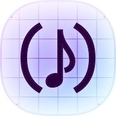

<h1 align="center">
<a href="https://cadence.id">
 cadence
</a>
</h1>

**cadence** is a spreadsheet-based live coding environment for web audio, with a Lisp-inspired embedded language.

## Getting started

### The language

- Numbers:  `1`, `1.37`, `-2`
- Strings: `'string`, `"longer string"`
- Static lists/tuples of strings: `'(a b c)`
- Dynamic lists `[A1 "b" 3]`
- Calling functions: `(function-name ...args)`
- Defining functions: `(λ (...argnames) ...body)`
- Cell references: `A1`, `ZZ137`

### Basics of music

Everything in **cadence** is synced to the **global transport**. Start it by calling the `trans` function, which also sets the tempo and time signature:

| | A |
|-|-|
| **1** | `(trans 120 '(4 4))` |

The `seq` function defines a sequence of **note events** that fires at a regular interval. This sequences emits the next note from the array every quarter note (`'4n`):

| | A |
|-|-|
| **2** | `(seq '4n '(c4 eb4 f4 ab4))` |

To distinguish note names from cell references, by convention we write them in lowercase.

The `synth` function creates a basic synthesiser:

| | A |
|-|-|
| **3** | `(synth)` |

To hear the synth, we need to connect it to the audio destination with the `->> function`:

| | A |
|-|-|
| **4** | `(->> A3)` |

And finally, to play notes, we map the note sequence with the `$>` function and call the `play` function on every event. `play` takes a reference to a playable object like a `synth`, a note duration, and a note event. It's **curried**, so by leaving off the last argument we get a function that can be passed into `$>` to recieve note events:

| | B |
|-|-|
| **2** | `($> A2 (play A3 '8n))` |

Putting that all together, we get a simple melody:

| | A | B |
|-|-|-|
| **1** | `(trans 120 '(4 4))` | |
| **2** | `(seq '4n '(c4 eb4 f4 ab4))` | `($> A2 (play A3 '8n))` |
| **3** | `(synth)` | |
| **4** | `(->> A3)` | |
